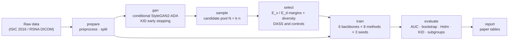

# DASS — Selecting GAN-Synthesized Images for Imbalanced Medical Image Classification

<!-- TODO: full name of the DASS acronym, paper title and venue -->

Official implementation of **DASS**, a selection method for synthetic training images. A class-conditional
**StyleGAN2-ADA** generates a pool of candidate images for the minority (disease) class. DASS keeps the candidates that
are **close to real minority images and far from the majority class**, measured both in a generic ImageNet feature space
and in a disease-aware feature space, while keeping the selected set **diverse**. Downstream classifiers are trained on
real + selected images and compared with seven controls, including random oversampling of real images, under a fixed,
leakage-free protocol.

**Benchmarks:** ISIC 2016 (dermoscopy, melanoma vs. benign) and RSNA Pneumonia (chest X-ray, lung opacity vs. none).
Both datasets run on the same code and the same selection formulas; only `configs/datasets/*.yaml` differs.

**Contents:**
[Overview](#overview) ·
[Method](#method) ·
[Datasets](#datasets) ·
[Evaluation protocol](#evaluation-protocol) ·
[Installation](#installation) ·
[Data preparation](#data-preparation) ·
[Usage](#usage) ·
[Outputs](#outputs) ·
[Repository structure](#repository-structure) ·
[Reproducibility](#reproducibility) ·
[Development](#development) ·
[Citation](#citation) ·
[References](#references)

---

## Overview



| Step | What happens |
|---|---|
| Generator | Class-conditional StyleGAN2-ADA, trained on the training split only; the snapshot with the lowest minority-class KID is kept. |
| Candidate pool | `N = ⌈k · n⌉` synthetic minority images, with `n = |majority| − |minority|` and `k = 1.5`. |
| Selection | Every generative method picks exactly `n` images from the **same pool**; methods differ only in the selection criterion. |
| Classifiers | 6 ImageNet-pretrained backbones (4 CNNs, 2 Transformers), 3 seeds each, identical training recipe for every method. |
| Evaluation | Real-only validation and test sets; fixed threshold 0.5; paired bootstrap ΔAUC with Holm adjustment; KID for image quality. |

## Method

### Selection score

For a candidate image `x`, `S±(x)` is the mean cosine similarity to its `K = 5` nearest **real** minority (`+`) or
majority (`−`) training images:

```
M(x)      = S⁺(x) − λ · S⁻(x)                          margin, computed in E_v and in E_d
S_div(x)  = min_{y ∈ selected} [1 − cos(z_x, z_y)]      distance to the images already selected
S_DASS(x) = α · M̃_v(x) + β · M̃_d(x) + γ · S̃_div(x)      ~ : min-max normalised; S_div re-normalised at every step
```

Selection is greedy: at each step the candidate with the highest `S_DASS` is added (`α = β = 1`, `γ = 0.5`, `λ = 1`).

| Feature space | Model | Training |
|---|---|---|
| `E_v` (visual) | EfficientNet-B0, ImageNet weights | frozen |
| `E_d` (disease) | DenseNet-121, separate seed | cross-entropy on the **real** training images only (augmentation + class weights); validation only for epoch selection |

### Compared methods

| Group | Method (paper name) | ID | Minority class in the training set |
|---|---|---|---|
| Real Data Baselines | **Imbalanced Baseline** | M0 | real images only (ISIC: class-weighted loss; RSNA: no reweighting) |
| | **Random Oversampling (ROS)** | M0b | real images duplicated up to 1 : 1 |
| Generative Augmentation (StyleGAN2-ADA) | **Unfiltered GAN (Random Selection)** | M1 | real + `n` random candidates |
| | **Visual-only Filter (M_v)** | M2 | real + top-`n` by `M̃_v` |
| | **Disease-only Filter (M_d)** | M3 | real + top-`n` by `M̃_d` |
| | **Diversity-only Filter (S_div)** | M5 | real + k-center greedy (no margin) |
| | **Dual-Margin Filter (M_v + M_d)** | M4 | real + top-`n` by `α·M̃_v + β·M̃_d` |
| | **DASS (Ours)** | M6 | real + greedy `S_DASS` |

ROS and all generative methods share the training-set size, the number of optimisation steps and the balancing mechanism
(data, not loss weights). **DASS vs. ROS** therefore isolates the contribution of the synthetic image *content*, and
**DASS vs. Unfiltered GAN** that of the *selection*. An optional control M7 (synthetic images added to both classes, to
neutralise a "synthetic ⇒ minority" shortcut) is available but off by default. Internal IDs are kept in all artefacts;
paper names are applied only when tables are written.

The full method, experimental design, statistics and threats to validity are documented in
[docs/GUIDE.md](docs/GUIDE.md) (Vietnamese).

## Datasets

| | ISIC 2016 Part 3 [2] | RSNA Pneumonia Detection Challenge 2018 [3, 4] |
|---|---|---|
| Modality | dermoscopy, RGB | chest X-ray, DICOM, grayscale (1 channel) |
| Classes (0 / **1**) | benign / **malignant** | no lung opacity / **lung opacity** (adjudicated radiologist label) |
| Images used | 900 train (727 / 173), official test set 379 (304 / 75) | 12,249 (10,738 / 1,511): one image per patient, "Exclude"-flagged images removed |
| Split | official test; 15 % of train → validation | stratified 70 / 15 / 15 |
| Train / val / test (neg + pos) | 618 + 148 / 109 + 25 / 304 + 75 | 7,522 + 1,059 / 1,606 + 226 / 1,610 + 226 |
| Imbalance (train) | 4.2 : 1 | 7.1 : 1 |
| Generator | reused checkpoint (3 channels, x-flips on) | trained from scratch (1 channel, **no x-flips**: chest anatomy is not left–right symmetric) |
| Classifier augmentation | flips, ±180° rotation, zoom, brightness, contrast | none (no data- or loss-level intervention) |

**RSNA specifics.** Patient identities come from the NIH ChestX-ray mapping released with the dataset; keeping one
image per patient prevents patient overlap between train, validation and test. View position is a known confounder
(positives are 58 % AP vs. 23 % of negatives, AP being typical of bedside imaging of sicker patients), so a
**pre-registered subgroup analysis by view position** is part of the evaluation.

## Evaluation protocol

- **No leakage.** The generator, DASS and `E_d` see the training split only. Validation and test sets contain real images
  only and are checked before training. A generator may only be reused with the split it was trained on (RSNA: checked
  automatically at every stage; ISIC: the split algorithm is locked by a regression test).
- **Model selection.** Validation is used only to pick the epoch (`val_macro_recall`). The test set is predicted once,
  after reloading the best checkpoint, with a **fixed threshold of 0.5**.
- **Same recipe for every method** within a dataset: data, split, generator, pool, `n`, hyper-parameters, augmentation
  and seeds (paired design).
- **Metrics.** ROC-AUC (primary), PR-AUC, sensitivity, specificity, balanced accuracy, G-mean, MCC, F1 — mean ± std over
  three seeds.
- **Statistics.** Paired, class-stratified bootstrap of ΔAUC (2,000 resamples) on seed-averaged predictions, with 95 % CI;
  p-values Holm-adjusted within each backbone; seed-paired ΔAUC (mean ± std) reported alongside. Comparisons: every
  method vs. the Imbalanced Baseline, plus DASS vs. ROS and DASS vs. Unfiltered GAN.
- **Synthetic image quality.** KID (primary, mean ± std over 50 subsets) and FID (reference) on the StyleGAN2-ADA
  Inception-v3 features, intra-set diversity and SSIM, and real-vs-synthetic separability (logistic probe on `E_v`).
- **Subgroups (RSNA).** AUC within the AP and PA groups, the AUC obtained from view position alone, and the share of
  AP-looking images among real positives, the synthetic pool and each method's selection.

## Installation

**Google Colab (GPU, recommended for the full pipeline; A100 or L4).** PyTorch and TensorFlow are pre-installed on Colab
and must not be reinstalled.

```bash
git clone https://github.com/honghanh22/isic-dass.git && cd isic-dass
pip install -r requirements.txt
pip install -e . --no-deps
```

**Local machine (no GPU):** configuration, data checks, selection, evaluation, tables and the test suite.

```bash
pip install -r requirements-dev.txt
pip install -e . --no-deps
pytest
```

| File | Contents |
|---|---|
| `requirements.txt` | core libraries + generator helpers (`ninja`, `click`, …) + `keras-hub`; no torch / tensorflow |
| `requirements-dev.txt` | core libraries + `pytest`, `ruff` |
| `pyproject.toml` | the same, as the package definition (`pip install -e ".[dev]"`, extras `gan`, `tf`, `dev`) |

Tested with Python 3.11–3.12; on Colab with PyTorch 2.11 + CUDA 13.0 (A100, L4). StyleGAN2-ADA is not vendored:
`dass gan-setup` clones the official NVlabs repository and applies small compatibility patches (PyTorch 2.x,
Python 3.12) at runtime.

## Data preparation

Place each dataset on Google Drive and point `configs/datasets/<name>.yaml` to it.

```
ISBI2016_ISIC_Part3/                               RSNA Pneumonia/   (RSNA website export, MD.ai format)
├── ISBI2016_ISIC_Part3_Training_Data/*.jpg        ├── <StudyUID>/<SeriesUID>/<SOPUID>.dcm
├── ISBI2016_ISIC_Part3_Training_GroundTruth.csv   ├── pneumonia-challenge-annotations-adjudicated-kaggle_2018.json
├── ISBI2016_ISIC_Part3_Test_Data/*.jpg            └── pneumonia-challenge-dataset-mappings_2018.json
└── ISBI2016_ISIC_Part3_Test_GroundTruth.csv
```

The DICOM source finds the files and the label JSON automatically (archives are extracted if needed). The Kaggle
release of RSNA (CSV labels) is also supported, but it lacks the patient mapping and the "Exclude" flags.

**Adding a dataset:** copy `configs/datasets/_template.yaml`, set the source, classes (disease class = 1),
preprocessing and split, give it its own `data.name` and `gan_tag`, and create an experiment file next to
`configs/experiments/rsna_pneumonia_dass.yaml`. No code change is needed for folder, CSV or DICOM sources. See
[docs/WORKFLOW.md](docs/WORKFLOW.md) for the checklist and current limitations.

## Usage

### Colab notebook

Open `notebooks/colab_pipeline.ipynb`. It mounts Drive, clones or updates this repository, installs the package and
runs one pipeline stage per cell. The notebook contains no logic; it only calls the `dass` command.

### Command line

```bash
E=configs/experiments/rsna_pneumonia_dass.yaml        # or configs/experiments/isic2016_dass.yaml

dass -c $E show-config                     # resolved configuration
dass -c $E run                             # every stage, prepare → report

dass -c $E prepare                         # ingest, preprocess, split, dataset card
dass -c $E gan-setup                       # clone + patch StyleGAN2-ADA, compile CUDA plugins
dass -c $E gan                             # train with KID early stopping (or reuse the trained generator)
dass -c $E sample                          # candidate pool
dass -c $E select                          # E_v / E_d, DASS and controls, shortcut diagnostics
dass -c $E train --model ResNet50          # one backbone: 8 methods × 3 seeds
dass -c $E evaluate                        # metrics, bootstrap, KID / FID, subgroups
dass -c $E report                          # paper tables
```

Every stage is resumable: finished artefacts (generator, pool, `E_d`, selections, predictions) are restored from Drive
or skipped. Useful options:

| Option | Example |
|---|---|
| Quick functional check (not for reporting) | `dass -c $E -c configs/experiments/smoke.yaml run` |
| Override one value | `--set selection.gamma=0` |
| Separate output folder for an ablation | `--tag nodiv` (appends to `run_tag`) |
| Reuse the main run's `E_d` in an ablation | `--set encoder.e_d_from_run=base --tag <name>` |
| Retrain runs made under another protocol | `train --model X --archive-mismatched` (old runs are moved, never deleted) |

Configuration is resolved in this order: `configs/_base_/*` → `configs/datasets/<name>.yaml` →
`configs/experiments/<name>.yaml` → extra `-c` profiles → `--set` → `--tag`. Unknown keys are rejected.

## Outputs

Results are written to `<drive_root>/results_<run_tag>/`. Paper tables are in `tables/`, each as `.csv` (formatted,
mean ± std), `.json` (raw numbers) and `.tex` (booktabs, best value per backbone in bold):

| Table | Content |
|---|---|
| `dataset` | images per split and class |
| `classification` | AUC, PR-AUC, F1, sensitivity, specificity, balanced accuracy, G-mean, MCC — mean ± std over seeds |
| `significance` | ΔAUC with 95 % CI, p-value, Holm-adjusted p and seed-paired ΔAUC (column `vs` = reference method) |
| `classification_by_subgroup`, `significance_by_subgroup` | RSNA: the same within the AP and PA subgroups |
| `subgroup_reference` | RSNA: AUC from view position alone |
| `subgroup_share` | RSNA: share of AP-looking images in real and synthetic sets |
| `generation_quality` | KID, FID, diversity, intra-set SSIM, real-vs-synthetic AUC for the pool and each selection |

Raw per-run numbers are in `metrics/`, one prediction file per run in `predictions/<model>__<method>__s<seed>.npz`,
diagnostic figures in `gan/` and `selection_figures/`. Column definitions: [docs/RESULTS_FORMAT.md](docs/RESULTS_FORMAT.md).

<details>
<summary>Artefact layout on Google Drive</summary>

```
<drive_root>/
├── checkpoints_<gan_tag>/stylegan2ada/        generator: best.pkl, latest.pkl, gan_state.json, logs and samples
├── checkpoints_<run_tag>/
│   ├── data/                                  split, dataset card, candidate pool (zip), selections, embeddings
│   └── classifiers/                           E_d and classifier weights
└── results_<run_tag>/
    ├── predictions/                           one .npz per (model, method, seed) — source of every table
    ├── metrics/                               raw numbers (.csv + .json)
    ├── tables/                                paper tables (.csv / .json / .tex)
    ├── gan/  selection_figures/  frequency_analysis/
    └── run_manifest.json                      per stage: git commit, resolved configuration, library versions
```

</details>

## Repository structure

```
.
├── README.md                   this file
├── requirements.txt            runtime dependencies (Colab)
├── requirements-dev.txt        local development and tests
├── pyproject.toml              package `dass`, CLI entry point `dass`
├── CHANGELOG.md                version history
├── CLAUDE.md                   project invariants and conventions (Vietnamese)
├── configs/
│   ├── _base_/                 shared recipe: generator, selection (DASS, E_d), classifier, evaluation, runtime
│   ├── datasets/               dataset-specific settings only: isic2016, rsna_pneumonia, _template
│   └── experiments/            experiment = base + dataset (+ smoke profile for quick checks)
├── src/dass/                   the Python package (all logic)
├── notebooks/                  Colab notebook (one cell per CLI stage), GPU check, archived original notebook
├── scripts/                    notebook generator
├── tests/                      unit + regression tests (no GPU, PyTorch or TensorFlow needed)
├── docs/                       guide, architecture, workflow, results format (Vietnamese)
└── colab_gpu_check.ipynb       legacy GPU check (superseded by notebooks/colab_gpu_check.ipynb)
```

<details>
<summary>Package layout (<code>src/dass/</code>)</summary>

```
src/dass/
├── cli.py                      `dass` command (stages, run, show-config, label-stats)
├── utils.py                    logging, seeding, atomic writes, code version
├── config/                     schema (dataclasses + validation), YAML loader, Layout (the only place defining paths)
├── data/                       every dataset difference lives here
│   ├── image_io.py             the only image reader / writer; native channel count preserved
│   ├── transforms.py           crop, pad, resize, PNG export
│   ├── sources/                csv, folders, dicom (MD.ai / Kaggle labels, patient mapping, metadata)
│   ├── splits/                 holdout_val, stratified (optionally patient-grouped), from a CSV file
│   ├── variants.py             per-method training folders (real + selected synthetic, or real copies)
│   └── loaders.py              tf.data pipelines, online augmentation, 1 → 3 channel replication in memory
├── models/
│   ├── generator/              StyleGAN2-ADA: runtime patches, dataset export, KID early stopping, sampling
│   ├── encoders/               E_v and E_d
│   └── classifiers/            EfficientNetV2B0, ResNet50, DenseNet121, ConvNeXtTiny, ViT-B16, SwinT
├── selection/                  margins (scoring.py) and DASS + controls (strategies.py) — numpy only
├── engine/                     two-stage classifier training, single test prediction
├── evaluation/                 metrics, bootstrap + Holm, KID / FID, subgroup analysis, paper tables
├── analysis/                   diagnostics only: probes, real-vs-synthetic AUC, frequency fingerprint, figures
└── pipeline/                   stage context, candidate pool, one module per CLI stage
```

`config/`, `data/` (except `loaders.py`), `selection/` and `evaluation/` are pure numpy / scikit-learn / PIL, so they
can be imported and tested without a GPU. TensorFlow and PyTorch are imported only inside the functions that need them.
Details: [docs/ARCHITECTURE.md](docs/ARCHITECTURE.md).

</details>

## Reproducibility

- Fixed seeds: split and global seed 2026, classifier seeds 2026 / 2027 / 2028, `E_d` seed 4242, pool seed 777.
- Splits are saved and checked on every run; changing the split under an existing `run_tag` stops the pipeline.
- Every prediction file records its training protocol (augmentation, class weights) and, from v1.9.0, the git commit
  and the test image names; runs under different protocols are never mixed in one table.
- `run_manifest.json` records, for every stage, the git commit, the resolved configuration and library versions.
- Artefacts are never deleted; a new configuration gets a new `run_tag` or `--tag`.

| Dataset | `gan_tag` | Main `run_tag` | Other runs kept for reporting |
|---|---|---|---|
| ISIC 2016 | `v5` | `v10` (k = 1.5, augmentation, class-weighted baseline) | `v9` (k = 2, no augmentation, unweighted), `v7` (k = 4) |
| RSNA Pneumonia | `rsna` | `rsna_v2` (k = 1.5, no augmentation, unweighted baseline) | `rsna_v1` (6,000-image subset, data preparation only) |

<!-- TODO: main results table once all backbones are finished -->

## Development

```bash
pip install -r requirements-dev.txt && pip install -e . --no-deps
pytest                                   # unit + regression tests, ~15 s, no GPU
ruff check src tests scripts
python -m compileall -q src              # syntax check of the TensorFlow / PyTorch modules
python scripts/build_colab_notebook.py   # regenerate the Colab notebook
```

Regression tests protect the project invariants: native channel count, split reproduction, artefact paths, dataset
isolation (local cache, generator bound to its data and split), protocol consistency of predictions and
requirements / `pyproject.toml` consistency. Code comments, logs and `docs/` are in Vietnamese; identifiers and this
README are in English.

## Acknowledgements

[StyleGAN2-ADA](https://github.com/NVlabs/stylegan2-ada-pytorch) (NVIDIA) is used as the generator, cloned at runtime
and unmodified apart from compatibility patches. [GANDCTAnalysis](https://github.com/RUB-SysSec/GANDCTAnalysis)
(Frank et al.) provides the optional frequency-fingerprint detector. We thank the ISIC Archive and the RSNA / STR /
NIH teams for releasing the datasets.

## Citation

```bibtex
@inproceedings{dass2026,
  title     = {TODO},
  author    = {TODO},
  booktitle = {TODO},
  year      = {2026}
}
```

<!-- TODO: license (none chosen yet). Dataset licences: ISIC Archive terms of use; RSNA Pneumonia — RSNA terms of use. -->

## References

1. T. Karras, M. Aittala, J. Hellsten, S. Laine, J. Lehtinen, T. Aila. *Training Generative Adversarial Networks with
   Limited Data.* NeurIPS 2020.
2. D. Gutman et al. *Skin Lesion Analysis toward Melanoma Detection: A Challenge at the International Symposium on
   Biomedical Imaging (ISBI) 2016.* arXiv:1605.01397.
3. G. Shih et al. *Augmenting the National Institutes of Health Chest Radiograph Dataset with Expert Annotations of
   Possible Pneumonia.* Radiology: Artificial Intelligence, 2019.
4. X. Wang et al. *ChestX-ray8: Hospital-scale Chest X-ray Database and Benchmarks on Weakly-Supervised Classification
   and Localization of Common Thorax Diseases.* CVPR 2017.
5. M. Buda, A. Maki, M. A. Mazurowski. *A systematic study of the class imbalance problem in convolutional neural
   networks.* Neural Networks, 2018.
6. M. Islam, H. Zunair, N. Mohammed. *CosSIF: Cosine similarity-based image filtering to overcome low inter-class
   variation in synthetic medical image datasets.* Computers in Biology and Medicine, 2024.
7. M. Bińkowski, D. J. Sutherland, M. Arbel, A. Gretton. *Demystifying MMD GANs.* ICLR 2018 (KID).
8. J. Frank et al. *Leveraging Frequency Analysis for Deep Fake Image Recognition.* ICML 2020.
